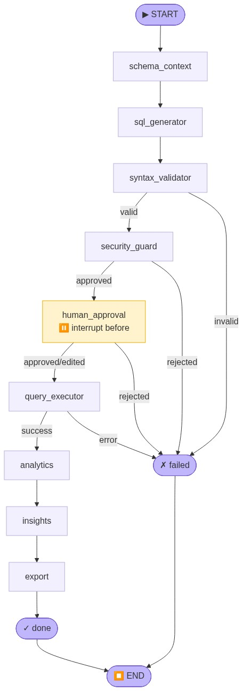

# Text-to-SQL Agent

## Team Git Standard

Branch naming: type/T-YYYY-MM-DD-NNN-short-slug (one task = one branch).

Commit message: type(scope): short summary [T-YYYY-MM-DD-NNN].

PR title: type: short summary [T-YYYY-MM-DD-NNN]; merge to main only via PR.

## Quick Setup Note

- If you use JetBrains IDEs, see `docs/JETBRAINS_VENV_CHECKLIST.md` for a minimal interpreter and terminal activation checklist for `venvtext2sql`.

## UI Launchers

- Chainlit UI:
  - `./run_main_chainlit.sh`
- Streamlit UI:
  - `./run_main_streamlit.sh`
  - Optional identity defaults via env vars:
    - `STREAMLIT_USER_ID`
    - `STREAMLIT_DISPLAY_NAME`

Both launchers load runtime environment values and pick a free localhost port when the corresponding `CHAINLIT_PORT` or `STREAMLIT_PORT` is not set.

## Query Graph (Current)



Comment: this diagram reflects the current `build_query_graph()` flow, including conditional branches to `failed` and the human-approval interrupt point.

## MCP Server Setup

This repository does not ship MCP server binaries. The expected deployment model is to run external MCP-compatible database servers and connect to them through the canonical contract documented in `src/text_to_sql_agent/models/mcp_contract.py`.

Current setup scope:
- SQLite MCP server for local file-backed query execution and schema access.
- PostgreSQL MCP server for local or remote Postgres instances.
- Athena MCP server for AWS-backed analytical querying.

Important boundary:
- This document defines infrastructure setup expectations and validation workflow.
- Canonical application-side runtime setting names for MCP endpoints and transport are handled separately by T-2026-06-05-109.

### Authentication Approach

Recommended authentication model by environment:
- Local development: prefer local process or stdio transport with filesystem access limited to the target SQLite file or locally trusted database credentials.
- Shared development and production: use environment-based secrets or secret-manager injection; do not hardcode credentials in source-controlled files.
- PostgreSQL: prefer password or IAM-backed credentials injected at runtime; use SSL when the database is remote.
- Athena: prefer IAM role-based authentication in production; use environment variables or AWS profile only for local development.

Secret handling rules:
- Keep secrets in environment variables or the configured secret backend.
- Do not commit tokens, DSNs, passwords, or AWS credentials.
- Treat any MCP bearer token or gateway credential as a secret equivalent to a database password.

### Required Environment Inputs

SQLite MCP prerequisites:
- `SQLITE_PATH`
- read access to the target SQLite database file

PostgreSQL MCP prerequisites:
- `PG_HOST`
- `PG_PORT`
- `PG_USER`
- `PG_PASSWORD`
- `PG_DATABASE`
- `PG_SSL_MODE` when remote TLS behavior must be explicit

Athena MCP prerequisites:
- `ATHENA_AWS_REGION`
- `ATHENA_S3_OUTPUT_LOCATION`
- `ATHENA_WORKGROUP`
- `ATHENA_CATALOG`
- `ATHENA_SCHEMA`
- AWS credentials via IAM role, `AWS_ACCESS_KEY_ID` / `AWS_SECRET_ACCESS_KEY` / `AWS_SESSION_TOKEN`, or AWS profile configuration

### Local Run Commands

Use the following command templates with the MCP server implementation chosen for your environment.

SQLite example:

```bash
SQLITE_PATH=tests/text_to_sql_agent/db/test_database.db \
<sqlite-mcp-server> --transport stdio --db "$SQLITE_PATH"
```

PostgreSQL example:

```bash
PG_HOST=localhost \
PG_PORT=5432 \
PG_USER=postgres \
PG_PASSWORD="$PG_PASSWORD" \
PG_DATABASE=text_to_sql_dev \
<postgres-mcp-server> --transport stdio
```

Athena example:

```bash
ATHENA_AWS_REGION=us-east-1 \
ATHENA_S3_OUTPUT_LOCATION=s3://your-bucket/athena-results/ \
ATHENA_WORKGROUP=primary \
ATHENA_CATALOG=AwsDataCatalog \
ATHENA_SCHEMA=default \
<athena-mcp-server> --transport stdio
```

Convenience launchers in this repository:

```bash
./run_mcp_server_sqlite.sh
./run_mcp_server_postgresql.sh
./run_mcp_server_athena.sh
```

By default, each launcher sources `.env.dev` from the repository root. Set `TEXT_TO_SQL_ENV_FILE` to use a different env file, and override the server binary with `MCP_SQLITE_SERVER_CMD`, `MCP_POSTGRESQL_SERVER_CMD`, or `MCP_ATHENA_SERVER_CMD` when your MCP implementation uses a different executable name.

### Preflight Validation Commands

Run a cheap dependency-scoped validation before wiring the server into the application.

SQLite preflight:

```bash
test -f "$SQLITE_PATH"
sqlite3 "$SQLITE_PATH" ".tables"
```

PostgreSQL preflight:

```bash
PGPASSWORD="$PG_PASSWORD" pg_isready -h "$PG_HOST" -p "$PG_PORT" -d "$PG_DATABASE" -U "$PG_USER"
```

Athena preflight:

```bash
aws athena list-data-catalogs --region "$ATHENA_AWS_REGION" --max-results 5
aws s3 ls "$ATHENA_S3_OUTPUT_LOCATION"
```

### MCP Contract Validation

After the backing database preflight succeeds, validate the MCP server behavior against the canonical tools:
- `mcp.db.health` must report connectivity for the target `database_id`.
- `mcp.db.schema` must return stable metadata for at least one known table or view.
- `mcp.db.execute` must succeed for a trivial read-only query such as `SELECT 1`.

Expected validation order:
1. confirm infrastructure credentials and network reachability,
2. start the MCP server,
3. run `mcp.db.health`,
4. run `mcp.db.schema`,
5. run `mcp.db.execute` with a safe read-only query.

### Production Notes

Recommended production posture:
- run MCP servers with least-privilege database credentials,
- isolate each dialect adapter behind its own deployment or process boundary,
- prefer IAM roles for Athena and TLS-enabled database connections for PostgreSQL,
- log allow/deny decisions and execution failures,
- keep database and MCP credentials in the configured secret backend rather than `.env.prod`.
